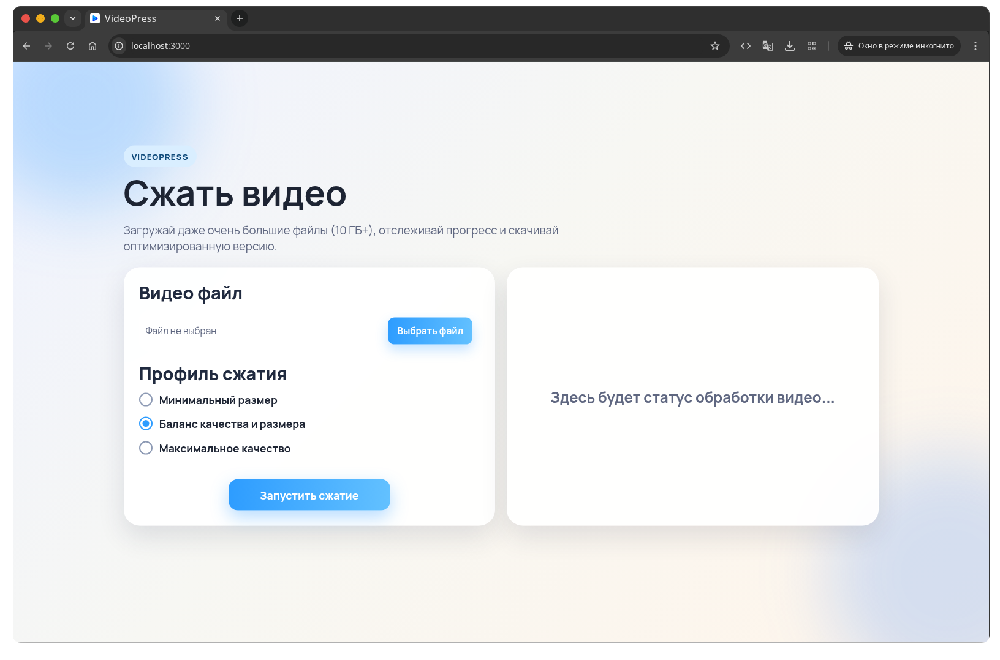

# VideoPress

Веб-приложение для сжатия больших видеофайлов (включая 10+ ГБ) через `ffmpeg`.



## Что умеет

- Загружает большие файлы потоково (без хранения всего файла в RAM).
- Сжимает видео на сервере в фоновом процессе.
- Показывает статус обработки, прогресс и примерное оставшееся время.
- Поддерживает паузу, продолжение и отмену сжатия.
- Дает скачать готовый результат.
- Очищает папку результатов по клику на корзину.

## Технологии

- Node.js
- Express
- Busboy
- ffmpeg / ffprobe
- HTML / CSS / Vanilla JS

## Требования

Перед запуском должны быть установлены:

- Node.js 18+
- npm
- `ffmpeg`
- `ffprobe`

Проверка:

```bash
node -v
ffmpeg -version
ffprobe -version
```

## Установка и запуск

```bash
npm install
npm start
```

После запуска откройте:

- http://localhost:3000

## Как работает сжатие

1. Файл загружается в `uploads/`.
2. Сервер определяет длительность через `ffprobe`.
3. Запускается `ffmpeg` с выбранным профилем.
4. Результат сохраняется в `outputs/` в формате `.mp4`.

### Профили сжатия

- `high` — максимальное сжатие (меньше размер).
- `medium` — баланс качества и размера.
- `low` — лучшее качество (меньше сжатие).

## Поддержка форматов

На вход можно подавать любые видео, которые читает `ffmpeg` (например, `.mp4`, `.mov`, `.mkv`).

На выходе:

- `.mp4` (H.264 + AAC)

## API

### Health

- `GET /api/health`
- Ответ: `{ "ok": true }`

### Загрузка и запуск

- `POST /api/upload`
- `multipart/form-data`:
  - `qualityPreset`: `high | medium | low`
  - `video`: файл
- Ответ: `{ "jobId": "..." }`

### Статус задачи

- `GET /api/jobs/:id`
- Возвращает статус, прогресс, размер исходника/результата и т.д.

### Скачать результат

- `GET /api/jobs/:id/download`
- Доступно только после завершения.

### Пауза

- `POST /api/jobs/:id/pause`

### Продолжить

- `POST /api/jobs/:id/resume`

### Отмена

- `DELETE /api/jobs/:id`

### Очистка результатов

- `DELETE /api/outputs`
- Удаляет все файлы из папки `outputs/`.

## Структура проекта

```text
video-compressor/
  public/
    icons/
    index.html
    script.js
    styles.css
  outputs/
  uploads/
  server.js
  package.json
  README.md
```

## Важные замечания

- Сжатие выполняется локально на сервере, а не в браузере.
- Для очень больших файлов убедитесь, что на диске достаточно места (`uploads` + `outputs`).
- Память не перегружается за счет потоковой загрузки, но диск и CPU используются активно.

## Возможные улучшения

- Авторизация и ограничение доступа.
- Хранение задач в БД.
- Очередь задач с ограничением параллелизма.
- Автоочистка старых файлов по TTL.
- Возобновляемая chunk-загрузка при обрыве сети.
